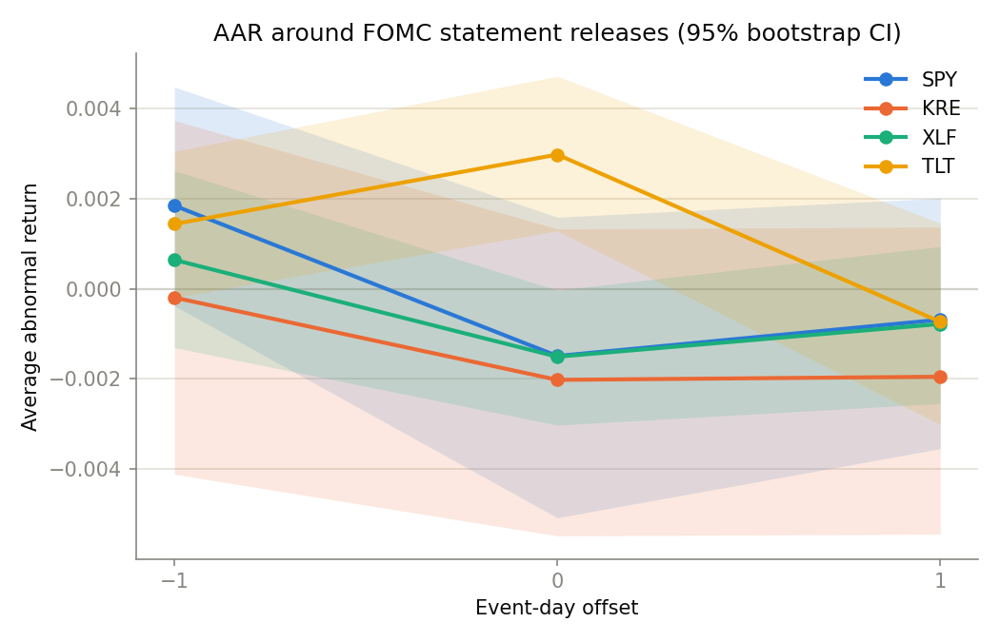
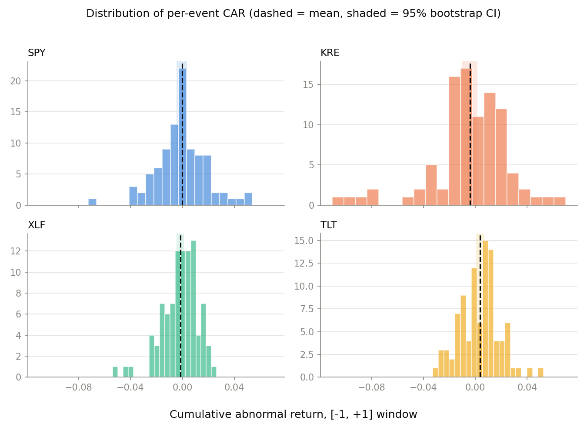

# FOMC Announcement Event Study

[](https://github.com/austi20/fomc-event-study/actions/workflows/tests.yml)

When the Fed releases a policy statement, does the market move in a way you can
actually measure? I tested that on 94 FOMC statement releases from January 2015
through July 2026 across four ETFs, using a market model event study.

**What I found.** Long dated Treasuries react, stocks mostly do not. TLT earns an
average abnormal return of **+0.30%** on the release day itself, with a 95%
bootstrap confidence interval of **[0.13%, 0.47%]** and a t test p value of
0.001. It is the only result in the study that the t test and the bootstrap both
agree on.

**What I expected and did not get.** I went in thinking regional banks would be
the story. They borrow short and lend long, so they should be the most rate
sensitive corner of the equity market. They were not. KRE averages a three day
cumulative abnormal return of -0.42% against SPY's -0.03%, and the bootstrap
interval on that difference runs from **-1.08% to +0.27%**. It contains zero, so
I cannot say the two are different. I am reporting the null result because that
is the answer the data gave, and a null result I can defend is worth more than a
significant one I cannot.

## The numbers





Release day only, one row per ticker:

| Ticker | Average abnormal return | 95% bootstrap CI | t test p |
|---|---|---|---|
| TLT | +0.30% | [0.13%, 0.47%] | 0.001 |
| XLF | -0.15% | [-0.30%, -0.003%] | 0.059 |
| KRE | -0.20% | [-0.55%, 0.13%] | 0.263 |
| SPY | -0.15% | [-0.51%, 0.16%] | 0.381 |

XLF is worth a second look, because the two methods disagree about it. The
bootstrap interval stops just short of zero at [-0.30%, -0.003%], which reads
like a real effect. The t test puts it at p = 0.059, which does not clear the
usual 0.05 bar. Both answers are sitting on the line, so I am not claiming it.

## How it works

For every ticker and every event, alpha and beta come from a market model fit on
the 221 trading days from `t-250` to `t-30`, far enough back that the
announcement itself is not in the training data. Abnormal return is then the
actual return minus what that model predicted, computed across a `[-1, +1]`
window around the release.

SPY is the market here, so regressing it on itself would be meaningless. It gets
a constant mean model instead.

From there the abnormal returns aggregate two ways. AAR is the average across
all 94 events at a single offset, which is what the first figure plots. CAR sums
the three days of the window for one event, which is what the second figure
distributes. Significance comes from a t test and a percentile bootstrap of
10,000 resamples with a fixed seed, so the intervals reproduce exactly.

## The data

`data/events.csv` holds the 94 statement release dates, which I assembled by
hand from the Fed's published
[FOMC calendar](https://www.federalreserve.gov/monetarypolicy/fomccalendars.htm).
Two things there are easy to get wrong and both are handled. Two day meetings
release the statement on the second day, not the first. The March 2020 emergency
intermeeting cuts are real statement releases, so they are flagged as
`unscheduled` rather than quietly dropped, and one of them landed on a Sunday
and rolls forward to the next trading day.

Prices are daily adjusted closes for SPY, KRE, XLF and TLT from `yfinance`,
cached to `data/raw/` on first run. `data/abnormal_returns.parquet` is the
output, one row per ticker, event and offset, committed so anyone can check the
numbers without hitting the API.

## Running it

```bash
pip install -r requirements.txt
pytest
jupyter nbconvert --to notebook --execute --inplace notebooks/01_event_study.ipynb
```

The notebook rebuilds every number and both figures from the event table and the
price cache. Nothing in it reads a precomputed result.

```
src/
  fomc_dates.py    # the event table
  returns.py       # price download, cache, log returns
  event_study.py   # market model, abnormal returns, AAR and CAR
  inference.py     # t tests and bootstrap intervals
  plots.py         # the two figures
tests/             # 30 pytest cases
notebooks/         # the analysis, start to finish
```

## What would break this

- **Overlapping estimation windows.** FOMC meetings sit about six weeks apart
  and the estimation window is 221 trading days, so one event's window covers
  several of its neighbors. The alphas and betas are not estimated from
  independent samples, which means their real sampling variance is wider than
  these numbers imply.
- **Volatility clustering.** Daily returns are not i.i.d. Volatile days arrive
  in clusters, so standard errors from both methods run small in exactly the
  stretches where returns are largest. The bootstrap resamples whole events
  rather than days inside an event, so it does not solve this either.
- **2020.** Two of the 94 events are the emergency cuts in March 2020. KRE
  averages -1.72% on those two against -0.39% on the other 92. With n = 2 that
  is an anecdote rather than a subgroup, but it is large enough to pull the full
  sample average.
- **Multiple testing.** I ran 12 t tests, one per ticker and offset, plus the
  KRE against SPY comparison, with no correction applied. At an uncorrected 0.05
  threshold about one apparent hit in 12 turns up by luck alone. TLT at p = 0.001
  clears a Bonferroni threshold anyway. XLF at p = 0.059 clears nothing.

## What I would do next

Widen the event window past three days and see whether the KRE effect shows up
slower than I assumed. Split the sample by whether the decision surprised the
market, using fed funds futures to measure the surprise, since pooling hikes,
cuts and holds together averages real reactions toward zero. Both are bigger
jobs than this one was.

## License

MIT.
