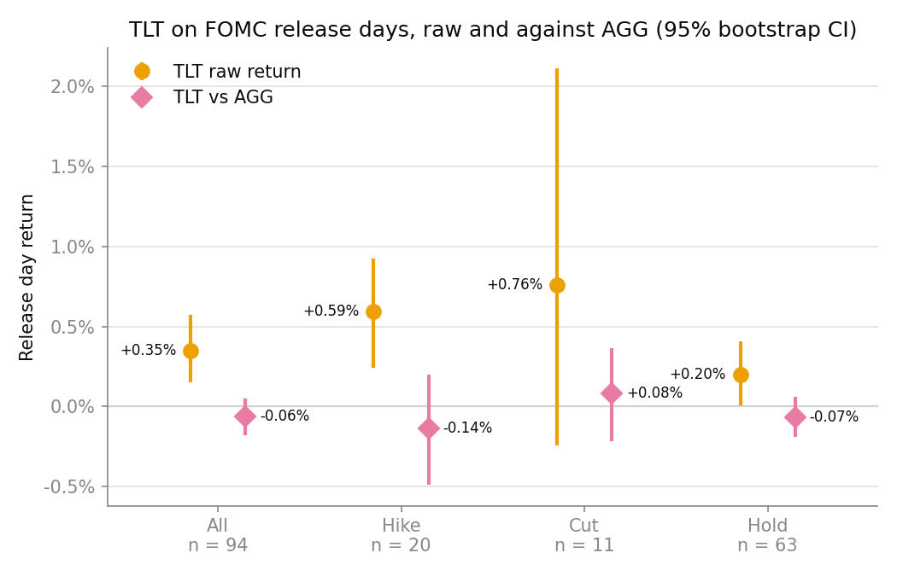
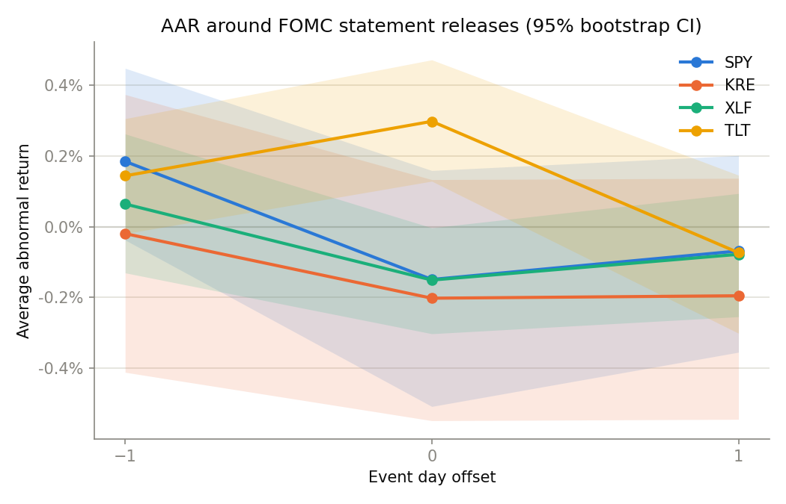
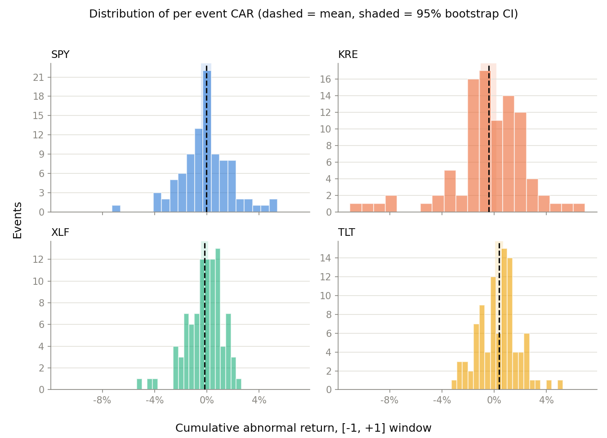

# FOMC Announcement Event Study

[](https://github.com/austi20/fomc-event-study/actions/workflows/tests.yml)

When the Fed releases a policy statement, does the market move in a way you can
actually measure? I tested that on 94 FOMC statement releases from January 2015
through July 2026 across four ETFs, using a market model event study, plus AGG
as a benchmark for the bond fund.

**What I found.** Bonds rally on statement days, and I could not find anything
in TLT beyond that.
TLT's raw return on the release day averages **+0.35%**, with a 95% bootstrap
confidence interval of **[0.15%, 0.57%]** and a t test p value of 0.002. AGG,
the aggregate US bond market, averages +0.15% on the same days. Measured against
AGG, TLT's abnormal return is **-0.06%** with an interval of **[-0.18%, 0.05%]**.
On an ordinary day TLT moves about 2.9 times as much as AGG, and that relation
explains its statement day move with nothing left that I can tell apart from
zero.

My first pass measured TLT against SPY and reported +0.30% as its abnormal
return. That number is right, but TLT's beta to SPY is -0.15, so a stock market
benchmark barely adjusts it. What looked like a long Treasury effect was the
bond market moving.

**What it means for a desk.** For a rates desk, statement day looks like a
duration trade rather than a bet on the long end, and for a bank equity desk,
regional banks gave nothing beyond their market beta to trade.

**What I expected and did not get.** I went in thinking regional banks would be
the story. They borrow short and lend long, so they should be the most rate
sensitive corner of the equity market. They were not. Once its usual 1.18 beta
to SPY comes out, KRE's release day abnormal return is **-0.20%**, with an
interval of **[-0.55%, 0.13%]** and p = 0.263. Comparing its three day CAR with
SPY's directly lands on the same null, an interval on the difference of -1.08%
to +0.27%. I am reporting the null result because that is the answer the data
gave, and a null result I can defend is worth more than a significant one I
cannot.

I also expected hikes and cuts to push bonds in opposite directions, so that
pooling them would average two real reactions toward zero. They do not. TLT
rallied on average after hikes, cuts and holds alike, and its largest move at a
scheduled meeting came on hikes, +0.59% raw at p = 0.004. Against AGG every
decision group sits within 0.14% of zero. My read is that the decision itself is
usually priced in before the statement lands, so whatever moves bonds on the day
is something else in the release. This data cannot say what.

## The numbers







The first figure is the bond result in one picture. The other two measure TLT
against SPY, which leaves it close to its raw return.

Release day only, one row per series:

| Series | Benchmark | Average return | 95% bootstrap CI | t test p |
|---|---|---|---|---|
| TLT raw return | none | +0.35% | [0.15%, 0.57%] | 0.002 |
| TLT abnormal | AGG | -0.06% | [-0.18%, 0.05%] | 0.288 |
| TLT abnormal | SPY | +0.30% | [0.13%, 0.47%] | 0.001 |
| AGG raw return | none | +0.15% | [0.07%, 0.24%] | < 0.001 |
| XLF abnormal | SPY | -0.15% | [-0.30%, -0.003%] | 0.059 |
| KRE abnormal | SPY | -0.20% | [-0.55%, 0.13%] | 0.263 |
| SPY | own trailing mean | -0.15% | [-0.51%, 0.16%] | 0.381 |

SPY's row is not the same kind of number as the others. It comes from the
constant mean model, so it is a raw move net of its own trend rather than a
market adjusted residual. It also sits at -0.149% against XLF's -0.151%, which
is why the two print identically here.

XLF is worth a second look, because the two methods disagree about it. The
bootstrap interval stops just short of zero at [-0.30%, -0.003%], which reads
like a real effect. The t test puts it at p = 0.059, which does not clear the
usual 0.05 bar. Both answers are sitting on the line, so I am not claiming it.

Split by what the Fed did, release day only, average with the t test p in
parentheses:

| Decision | n | TLT raw | TLT vs AGG | KRE vs SPY | XLF vs SPY | SPY |
|---|---|---|---|---|---|---|
| Hike | 20 | +0.59% (0.004) | -0.14% (0.45) | -0.42% (0.28) | -0.20% (0.19) | +0.08% (0.80) |
| Cut | 11 | +0.76% (0.26) | +0.08% (0.61) | -0.42% (0.51) | -0.50% (0.17) | -1.63% (0.16) |
| Hold | 63 | +0.20% (0.054) | -0.07% (0.30) | -0.09% (0.67) | -0.07% (0.42) | +0.04% (0.76) |

The cut row needs a warning. Two of the 11 cuts are the March 2020 emergency
moves. SPY's -1.63% on cuts is -7.32% on those two and -0.36% on the nine
scheduled ones. TLT's +0.76% splits the same way, +3.91% against +0.06%. With
n = 11 and two of them from a crash, the cut row does not tell me much. The
notebook has the intervals for every cell.

## How it works

Everything runs on daily log returns. That is what lets CAR be a plain sum,
since log returns add across days and simple returns do not. At the size of
these moves a log percent and a percent differ by far less than the error bars
around them, so I report them as percents.

For every ticker and every event, alpha and beta come from a market model fit on
the 221 trading days from `t-250` to `t-30`, far enough back that the
announcement itself is not in the training data. Abnormal return is then the
actual return minus what that model predicted, computed across a `[-1, +1]`
window around the release.

SPY is the market here, so regressing it on itself would be meaningless. It gets
a constant mean model instead. That is worth being explicit about, because it
means one column holds two different quantities. KRE, XLF and TLT abnormal
returns are what is left after their exposure to SPY comes out. SPY's is just
its move net of its own trailing average.

TLT then gets run a second time with AGG as its market, using the same windows
and the same code. A Treasury fund's market is the bond market, and a stock
benchmark leaves almost all of a bond move in the residual. I report TLT's raw
return next to both versions, so it is clear what each benchmark takes out.

From there the abnormal returns aggregate two ways. AAR is the average across
all 94 events at a single offset, which is what the second figure plots. CAR
sums the three days of the window for one event, which is what the third figure
distributes. Significance comes from a t test and a percentile bootstrap of
10,000 resamples with a fixed seed, so the intervals reproduce exactly. The
decision split reruns the release day numbers inside each group of hikes, cuts
and holds.

## The data

`data/events.csv` holds the 94 statement release dates, which I assembled by
hand from the Fed's published
[FOMC calendar](https://www.federalreserve.gov/monetarypolicy/fomccalendars.htm).
Two things there are easy to get wrong and both are handled. Two day meetings
release the statement on the second day, not the first. The March 2020 emergency
intermeeting cuts are real statement releases, so they are flagged as
`unscheduled` rather than quietly dropped, and one of them landed on a Sunday
and rolls forward to the next trading day.

Each event is also tagged `hike`, `cut` or `hold`, written into
`src/fomc_dates.py`. I took the tags from FRED's series for the top of the fed
funds target range, [DFEDTARU](https://fred.stlouisfed.org/series/DFEDTARU),
comparing the day before the statement with a week after it. Comparing on the statement date
alone would miss moves, because FRED records the new range on the statement day
for some meetings and on the day after for others. That gives 20 hikes, 11 cuts
and 63 holds.

Prices are daily adjusted closes for SPY, KRE, XLF and TLT from `yfinance`,
pulled on 2026-09-15 and running from 2014-01-02 to that date. The event table
stops at the last statement released before that pull, which is why the sample
ends in July 2026. AGG was added later, pulled on 2026-10-06 and cut off at
2026-09-15 so it lines up. I kept the original pull for the other four instead
of refreshing it, because a fresh pull shifts some of their daily returns
slightly, for the reason below. `data/raw/` is gitignored, so a fresh clone
refills the cache from the API the first time it runs.

That last part matters for reproducing this. Adjusted closes get revised every
time a dividend or a split lands, so a pull a year from now will not match mine
to the last decimal. `data/abnormal_returns.parquet` is committed for exactly
that reason, one row per ticker, event and offset with the alpha and beta behind
each one, so anyone can check the numbers against the ones I actually ran.
`data/tlt_vs_agg.parquet` holds the TLT against AGG rows in the same layout,
and `data/aar_by_offset.csv` is the first AAR figure as a table.
`python -m src.event_study` rewrites all three from the cached prices.

## Running it

```bash
pip install -r requirements.txt
pytest
jupyter nbconvert --to notebook --execute --inplace notebooks/01_event_study.ipynb
```

The notebook rebuilds every number and all three figures from `data/events.csv` and
the price data. Nothing in it reads a precomputed result. The first run pulls
about twelve years of daily closes from `yfinance` and caches them, so it needs
a network connection once. If you would rather just read it, GitHub renders it
with the output already in place:
[notebooks/01_event_study.ipynb](notebooks/01_event_study.ipynb).

```
src/
  fomc_dates.py    # the event table and decision tags
  returns.py       # price download, cache, log returns
  event_study.py   # market model, abnormal returns, AAR and CAR
  inference.py     # t tests and bootstrap intervals
  plots.py         # the three figures
tests/             # the test suite
notebooks/         # the analysis, start to finish
```

## What would break this

- **AGG reacts to the Fed too.** Benchmarking TLT against something that moves
  on the same news takes that news out by design. So the -0.06% answers whether
  TLT did anything beyond the bond market, not whether the Fed moved TLT. The
  raw return answers the second question, and it says yes.
- **Overlapping estimation windows.** FOMC meetings sit about six weeks apart
  and the estimation window is 221 trading days, so one event's window covers
  several of its neighbors. The alphas and betas are not estimated from
  independent samples, which means their real sampling variance is wider than
  these numbers imply.
- **Volatility clustering.** Daily returns are not i.i.d. Volatile days arrive
  in clusters, so standard errors from both methods run small in exactly the
  stretches where returns are largest. The bootstrap resamples whole events
  rather than days inside an event, so it does not solve this either.
- **2020.** Two of the 94 events are the emergency cuts in March 2020. KRE's
  average CAR on those two is -1.72% against -0.39% on the other 92. With n = 2
  that is an anecdote rather than a subgroup, but it is large enough to pull the
  full sample average, and it dominates the cut row of the decision split.
- **The KRE against SPY comparison is blunt.** KRE's abnormal return already
  has its market exposure taken out, so subtracting SPY's on top removes the
  market a second time. What that tests is closer to KRE's return minus 2.18
  times the market's than to one reaction minus another. That is why the bank
  result rests on KRE's own abnormal return, and the paired comparison is only a
  cross check.
- **Multiple testing.** The original analysis ran 13 tests: 12 one sample t
  tests, one per ticker and offset, plus the paired KRE against SPY test. If
  they were independent, 13 tests at an uncorrected 0.05 would throw up at least
  one false hit about half the time. Bonferroni puts the bar at
  0.05 / 13 = 0.0038. TLT at p = 0.001 clears it. XLF at p = 0.059 clears
  nothing.
- **The follow ups add 18 more tests.** Three for the TLT benchmark check and
  fifteen in the decision split, 31 in all. At 0.05 / 31 = 0.0016, TLT against
  SPY and AGG's raw move still clear. TLT's raw move at p = 0.0017 narrowly
  misses, and nothing in the decision split clears, so I read the split as
  description rather than as new findings.

## What I would do next

Split the sample by whether the decision surprised the market, using fed funds
futures to measure the surprise. The decision split suggests the announced
move is not what drives the reaction, and the surprise is the obvious next
candidate.
I would also widen the event window past three days and see whether the KRE
effect shows up slower than I assumed. Both are bigger jobs than this one was.

## License

MIT.
